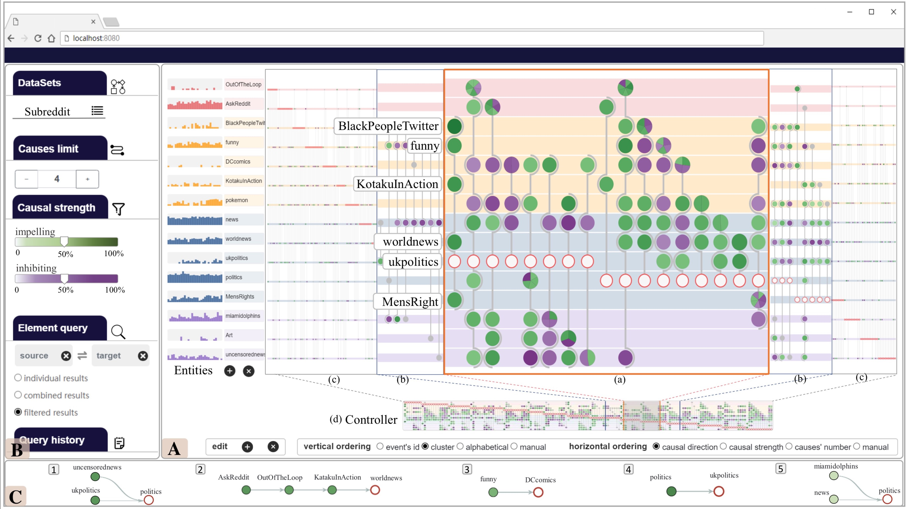
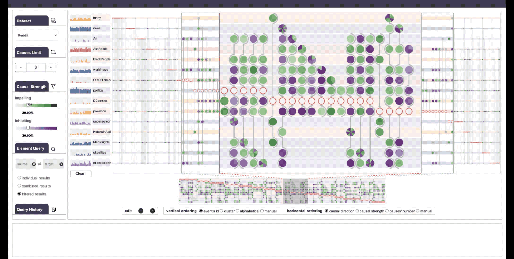
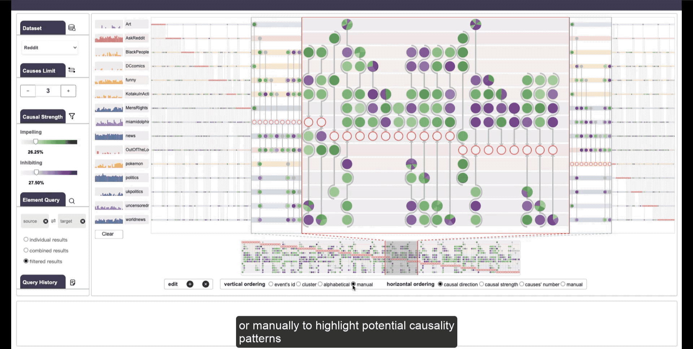
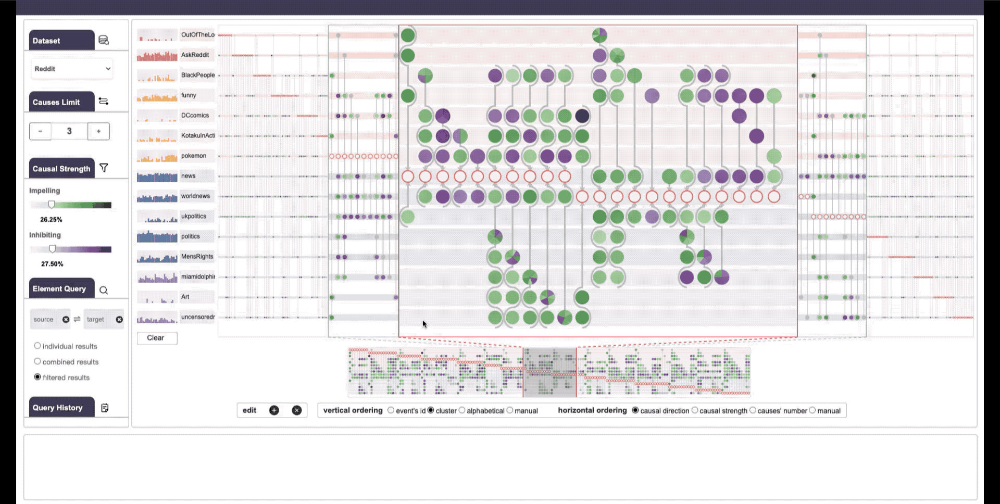

# VAC2
VAC2: Visual Analysis of Combined Causality in Event Sequences

## Online Demo

https://zhuzihao-hz.github.io/VAC2/

## Abstract

Identifying causality behind complex systems plays a significant role in different domains, such as decision making, policy implementations, and management recommendations. However, existing causality studies on temporal event sequences data mainly focus on individual causal discovery, which is incapable of exploiting combined causality. To fill the absence of combined causes discovery on temporal event sequence data, eliminating and recruiting principles are defined to balance the effectiveness and controllability on cause combinations. We also leverage the Granger causality algorithm based on the reactive point processes to describe impelling or inhibiting behavior patterns among entities. In addition, we design an informative and aesthetic visual metaphor of “electrocircuit” to encode aggregated causality for ensuring our causality visualization is non-overlapping and non-intersecting. Diverse sorting strategies and aggregation layout are also embedded into our parallel-based, directed and weighted hypergraph for illustrating combined causality. Our developed combined causality visual analysis system can help users effectively explore combined causes as well as an individual cause. This interactive system supports multi-level causality exploration with diverse ordering strategies and a focus and context technique to help users obtain different levels of information abstraction. The usefulness and effectiveness of the system are further evaluated by conducting a pilot user study and two case studies on event sequence data.

## System Overview

## Interaction Screenshots & Gifs

### Filter

### Drag

### Sort

### Search

